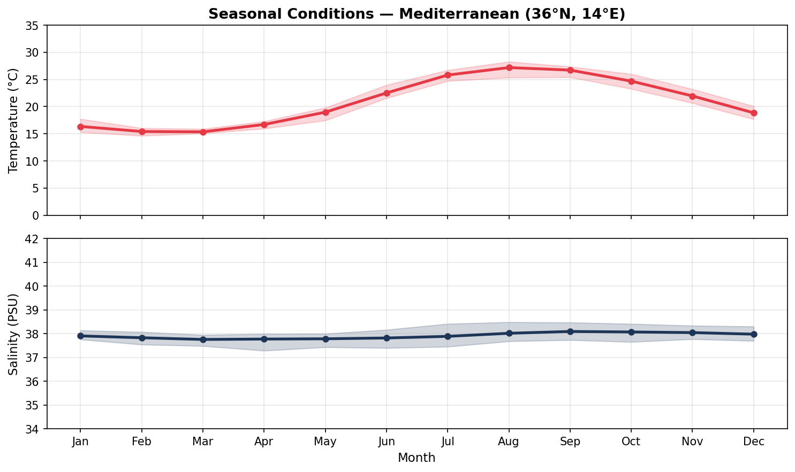
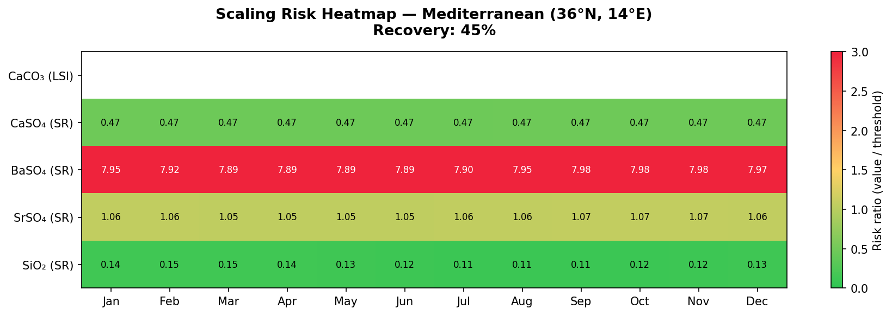

# RO Scaling Risk Estimator

A physics-based tool for estimating scaling risk in reverse osmosis 
membranes during conceptual design of seawater desalination plants.

---

## The Problem

In early design phases, engineers often lack a real water analysis 
for the plant site, or have a single point-in-time sample that does 
not reflect seasonal variability.

Designing with a single water quality value can lead to:
- Undersizing the antiscalant dosing system
- Setting an aggressive recovery for critical seasonal conditions
- Scaling risk appearing only in the last membrane elements,
  invisible to whole-train average calculations

---

## What This Tool Does

Given the **geographic coordinates** of a coastal desalination plant 
and a **target recovery rate**, this tool:

1. Retrieves 10+ years of historical temperature and salinity data 
   from **Copernicus Marine Service (CMEMS)**
2. Reconstructs the full ionic profile of the feed water using 
   Millero et al. (2008) standard seawater composition
3. Calculates saturation indices along the RO train element by element
4. Shows how scaling risk varies throughout the year

---

## Results

### Seasonal Conditions — Mediterranean (36°N, 14°E)


### Scaling Risk Heatmap — Recovery 45%


**Reading the heatmap**: green = safe, yellow = near threshold, 
red = scaling risk. Values shown are the actual index 
(LSI for CaCO₃, Saturation Ratio for others).

---

## Key Engineering Findings (Mediterranean case)

- **BaSO₄** exceeds SR=1 from the first membrane element at any 
  recovery rate. Specific antiscalant required regardless of recovery.
- **SrSO₄** sits just above SR=1 throughout the year. 
  Moderate but constant risk.
- **CaSO₄** and **SiO₂** show no risk at 45% recovery.
- The element-by-element profile reveals that the last membrane 
  elements operate at ~1.8× the feed concentration, 
  concentrating scaling risk at the tail of the train.

---

## Scope and Limitations

**Works well for:**
- Open ocean and semi-enclosed seas (Mediterranean, Red Sea, 
  Persian Gulf, Atlantic coast)

**Less accurate for:**
- Coastal areas with significant freshwater input (rivers, estuaries)
- Areas with strong industrial influence

**Not applicable to:**
- Brackish water or inland sources

**Known model limitations:**
- CaCO₃ LSI may be underestimated when using reconstructed ionic 
  profiles, because real alkalinity often exceeds the Forchhammer 
  prediction. A real water analysis is recommended for CaCO₃ 
  assessment when available.
- Activity coefficients use fixed approximations (γ_Ca=0.2, 
  γ_SO₄=0.1) valid for seawater ionic strength range. 
  For rigorous speciation, use PHREEQC.
- Silica does not follow Forchhammer principle. Default value of 
  8 mg/L used; adjust if site data is available.

---

## Project Structure

ro-scaling-risk/
│
├── core/
│   ├── scaling_indices.py    # LSI, SR calculations with activity coefficients
│   ├── ro_concentration.py   # Element-by-element concentration profile
│   └── water_chemistry.py    # Ionic profile reconstruction from salinity
│
├── copernicus/
│   └── fetcher.py            # CMEMS API connection, climatology
│
├── outputs/
│   └── risk_report.py        # Visualizations
│
└── test_scaling.py           # Validation cases

---

## Scientific References

- Millero, F.J. et al. (2008). The composition of Standard Seawater 
  and the definition of the Reference-Composition Salinity Scale. 
  *Deep-Sea Research I*, 55, 50-72.
- Langelier, W.F. (1936). The analytical control of anti-corrosion 
  water treatment. *Journal AWWA*, 28(10), 1500-1521.
- UNESCO (1983). Algorithms for computation of fundamental properties 
  of seawater.

---

## Requirements

```bash
pip install numpy scipy matplotlib copernicusmarine xarray pandas
```

Copernicus Marine Service account required (free registration at 
marine.copernicus.eu).

---

## Author

Álvaro Mendoza — Process Engineer, Water Sector  
[www.linkedin.com/in/alvaro-mendoza-bonilla]
